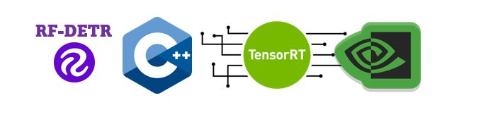

# RF_DETR C++ TensorRT



[](https://github.com/yourusername/RF_DETR-TensorRT)
[](https://github.com/yourusername/RF_DETR-TensorRT/blob/main/LICENSE)

## 📜 Citation

The **RF_DETR C++ TensorRT Project** is a high-performance object detection solution implemented in C++ and optimized using NVIDIA TensorRT. This project leverages the RF_DETR model architecture to deliver fast and accurate object detection, utilizing TensorRT to maximize inference efficiency and performance.

---

## 📢 Updates

### Key Features:

* **Model Optimization**: TensorRT engine generation from RF_DETR ONNX models for accelerated inference.
* **Efficient Inference**: High-speed object detection on images and videos.
* **CUDA Preprocessing**: Utilizes CUDA for accelerated image preprocessing.
* **C++ Implementation**: Robust and efficient C++ codebase.

---

## 📂 Project Structure

    RF_DETR-TensorRT/
    ├── CMakeLists.txt          # Build configuration for the project [cite: 1]
    ├── include/                # Header files
    ├── src/
    │   ├── main.cpp            # Main entry point for the application
    │   ├── RF_DETR.cpp         # RF_DETR implementation
    │   └── preprocess.cu       # CUDA preprocessing code [cite: 1]
    ├── assets/                 # Resources
    └── build/                  # Compiled binaries

## 🛠️ Setup

### Prerequisites

* **CMake** (version 3.18 or higher)
* **TensorRT** (8.6.1.6)
* **CUDA Toolkit** (11.7)
* **OpenCV** (4.10)
* **NVIDIA GPU** (with appropriate compute capability)

### Installation

1.  Clone the repository:

    ```bash
    git clone [https://github.com/hamdiboukamcha/RF-DETR-CPP-TENSORRT.git](https://www.google.com/search?q=https://github.com/hamdiboukamcha/RF-DETR-CPP-TENSORRT.git)
    cd RF-DETR-CPP-TENSORRT
    ```

2.  Update the OpenCV and TensorRT paths in `CMakeLists.txt`:

    ```bash
    set(MY_OpenCV_INCLUDE_DIRS "path/to/opencv/include")   # EDIT THIS PATH [cite: 2]
    set(MY_OpenCV_LIB_DIR      "path/to/opencv/lib")      # EDIT THIS PATH [cite: 2]
    set(MY_TensorRT_INCLUDE_DIRS "path/to/tensorrt/include") # EDIT THIS PATH [cite: 2]
    set(MY_TensorRT_LIB_DIR      "path/to/tensorrt/lib")      # EDIT THIS PATH [cite: 2]
    ```

    * Use forward slashes `/` even on Windows. [cite: 2]
    * Ensure these paths point to the correct directories for your installations. [cite: 5, 6]

3.  Verify OpenCV and TensorRT Library Names

    ```cmake
    set(MY_OpenCV_LIBS opencv_world4100d) # EDIT IF NEEDED [cite: 4]
    set(MY_TensorRT_LIBS nvinfer nvparsers nvonnxparser) # EDIT IF NEEDED [cite: 4]
    ```

    * Check these library names against the actual files in your library directories. [cite: 3, 4]
    * Remove the 'lib' prefix and file extensions (.so, .lib, .dll). [cite: 3]

4.  Build the project:

    ```bash
    mkdir build
    cd build
    cmake ..
    make -j$(nproc)
    ```

## 🚀 Usage

### Inference

The compiled application can be used to perform object detection using a TensorRT engine.  Specific usage instructions will depend on the final application design (e.g., command-line arguments).  Here's a general outline:

1.  **Engine Generation:** If you need to create a TensorRT engine from an RF_DETR ONNX model, you'll likely have a conversion tool or functionality within the project.  *(Add specific instructions if applicable)*
2.  **Running Inference:** The application will take inputs (images or videos) and the TensorRT engine as input.  It will then perform object detection and output the results (e.g., bounding boxes, class labels, confidence scores).  *(Add specific command-line arguments or API usage if applicable)*

    Example (Illustrative):

    ```bash
    ./rf_detr_app --engine rf_detr.engine --input image.jpg --output results.json
    ```

    *(Replace with the actual usage for your application)*

## ⚙️ Configuration

### CMake Configuration

The `CMakeLists.txt` file is used to configure the project build. Key configuration options include:

* **OpenCV Paths**:  `MY_OpenCV_INCLUDE_DIRS`, `MY_OpenCV_LIB_DIR` [cite: 2]
* **TensorRT Paths**: `MY_TensorRT_INCLUDE_DIRS`, `MY_TensorRT_LIB_DIR` [cite: 2]
* **Library Names**: `MY_OpenCV_LIBS`, `MY_TensorRT_LIBS` [cite: 4]
* **CUDA Settings**: `CMAKE_CUDA_STANDARD`, `CMAKE_CUDA_STANDARD_REQUIRED`, `CMAKE_CUDA_ARCHITECTURES` (if needed)
    * CUDA is found automatically, but you can adjust settings like the CUDA standard. [cite: 5, 7]

## 🛠️ Troubleshooting

* **OpenCV/TensorRT Not Found**: Double-check the paths in `CMakeLists.txt` and ensure the libraries are installed correctly. [cite: 5, 6]
* **Linking Errors**: Verify that the library names in `CMakeLists.txt` match your library files. [cite: 3, 4]
* **CUDA Errors**: Ensure your CUDA installation and drivers are correct.

## 📞 Contact

For advanced inquiries, feel free to contact me on LinkedIn: <a href="https://www.linkedin.com/in/hamdi-boukamcha/" target="_blank"> </a>

## 📜 Citation

If you use this code in your research, please cite the repository as follows:

        @misc{boukamcha2025-rf-detr,
            author = {Hamdi Boukamcha},
            title = {RF-DETR-CPP-TENSORRT},
            year = {2025},
            publisher = {GitHub},
            howpublished = {\url{https://github.com/hamdiboukamcha/RF-DETR-CPP-TENSORRT/}},
        }
